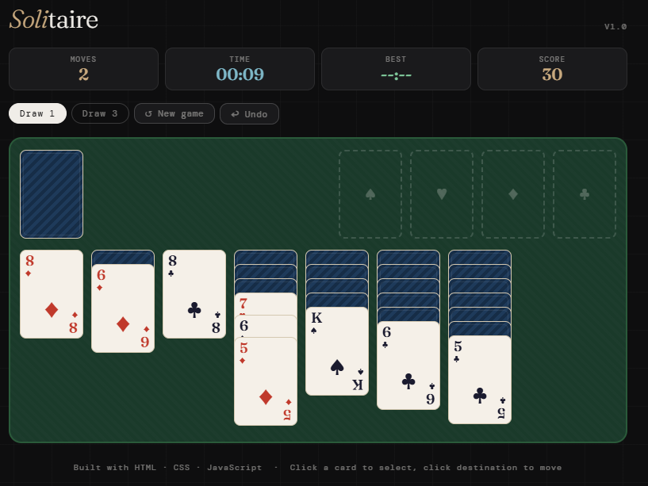

# 🃏 Solitaire

A fully-featured Solitaire game built with vanilla HTML, CSS, and JavaScript. No frameworks, no dependencies.

[](https://nayanymous.github.io/solitaire-js)
[](https://github.com/nayanymous/solitaire-js)

---

## ✨ Features

- **Draw 1 & Draw 3 modes**: selectable, each with its own best time
- **Full Klondike rules**: stock, waste, 4 foundations, 7 tableau columns
- **Double-click to auto-send**: double-click any card to send it to a valid foundation
- **Auto-complete**: finishes the game automatically once all cards are face-up
- **Undo**: step back up to 40 moves
- **Move counter**: tracks every move made
- **Live timer**: tracks solve time, starts on first move
- **Best time**: saved per draw mode in localStorage
- **Score system**: points for moves, flips, foundations; penalty for recycling stock
- **Valid move highlighting**: green highlight on valid drop targets
- **Felt table design**: classic green baize aesthetic
- **Zero dependencies**: pure HTML, CSS, JavaScript

---

## 🚀 Live Demo

👉 [Play it here](https://nayanymous.github.io/solitaire-js)

---

## 📸 Screenshot



---

## 🕹️ How to Play

1. **Click** a card to select it (highlighted in gold)
2. **Click** a valid destination to move it
3. **Double-click** any card to auto-send to foundation
4. **Click the stock** (top-left) to draw cards
5. **Click ↺** on empty stock to recycle the waste pile
6. Build foundations A → K per suit to win!

---

## 📊 Scoring

| Action | Points |
|---|---|
| Card to foundation | +15 |
| Waste to tableau | +5 |
| Flip face-down card | +10 |
| Draw from stock | +5 |
| Recycle waste pile | -100 |

---

## 🛠️ Tech Stack

| Technology | Usage |
|---|---|
| HTML5 | Game structure & card layout |
| CSS3 | Felt table, card styling, animations |
| Vanilla JavaScript | Game logic, state management, undo |
| localStorage | Best time per draw mode |

---

## 🧠 How It Works

### State management
The entire game state (stock, waste, foundations, 7 tableau piles) is stored as plain JavaScript arrays. Every move saves a deep copy of the state to a history stack for undo support.

### Undo system
Before every move, the full game state is cloned and pushed to a history array (capped at 40). Undo pops the last state and restores it.

### Auto-complete detection
After every move, the game checks if all cards are face-up and the stock is empty. If so, the auto-complete button appears, which repeatedly sends cards to foundations in 80ms intervals.

### Move validation
- **Tableau**: alternating colors, descending rank, Kings on empty columns
- **Foundation**: same suit, ascending rank starting from Ace

---

## 📂 Project Structure

```
solitaire-js/
├── index.html       ← entire game in one file
├── README.md        ← this file
└── screenshot.png   ← gameplay screenshot
```

---

## ▶️ Run Locally

```bash
git clone https://github.com/nayanymous/solitaire-js.git
cd solitaire-js
open index.html
```

---

## 🌐 Deploy to GitHub Pages

1. Push this repo to GitHub
2. Go to **Settings → Pages**
3. Set source to `main` branch, `/ (root)`
4. Live at `https://nayanymous.github.io/solitaire-js`

---

## 📌 What I Learned

- **Complex state management**: deep cloning nested arrays for undo
- **Game rule implementation**: full Klondike rules in pure JS
- **Dynamic DOM rendering**: building card layouts without a framework
- **Event delegation**: efficient click handling on dynamic elements
- **Auto-complete algorithm**: repeatedly finding valid foundation moves
- **localStorage**: per-mode best time tracking

---

## 📬 Connect

Made by **Md. Rakibul Islam Nayan** · [LinkedIn](https://www.linkedin.com/in/rakibul-islam-nayan/) · [GitHub](https://github.com/nayanymous)

---

